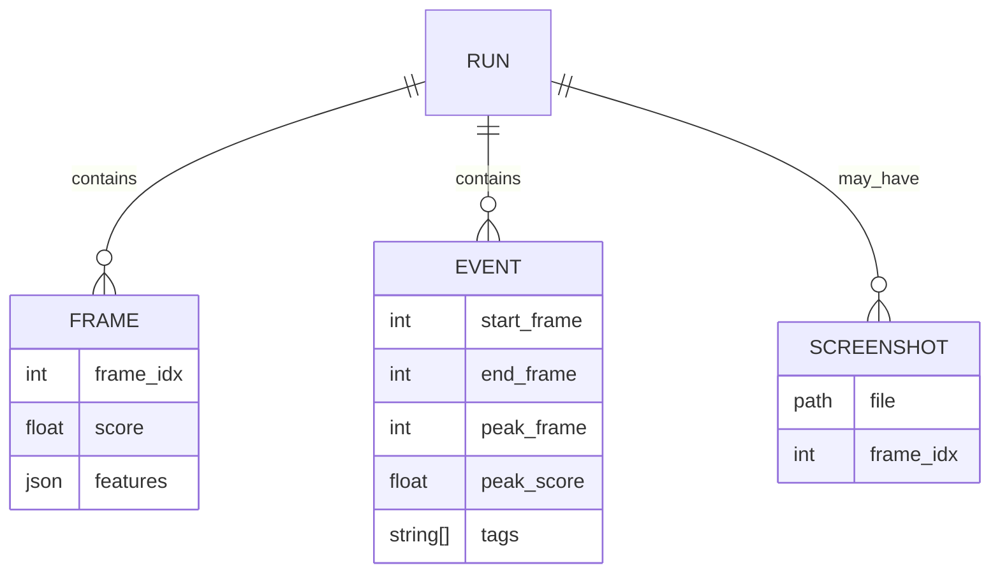

# 🎯 AI Surveillance Anomaly Detection Dashboard

[](https://python.org)
[](https://streamlit.io)
[](https://github.com/ultralytics/ultralytics)
[](https://lightgbm.readthedocs.io)

A comprehensive real-time anomaly detection system for video surveillance using state-of-the-art machine learning models. The dashboard combines **YOLOv8** object detection, **DeepSORT** tracking, and **LightGBM** classification to identify anomalous behavior in video streams with an intuitive web interface.

## 🌟 Features

### 🔍 **Advanced Detection Pipeline**
- **YOLOv8 Object Detection**: High-accuracy object detection with customizable classes
- **DeepSORT Tracking**: Persistent object tracking with unique IDs across frames
- **LightGBM Scoring**: Machine learning-based anomaly classification
- **Real-time Processing**: Configurable FPS processing for optimal performance

### 📊 **Interactive Dashboard**
- **Live Video Display**: Real-time video playback with detection overlays
- **Anomaly Score Visualization**: Dynamic plotting with threshold indicators
- **Event Detection**: Automatic anomaly event identification with hysteresis
- **Screenshot Capture**: Automatic screenshot saving during anomaly events

### 💾 **Intelligent Caching System**
- **Replay Mode**: Instant replay using cached detections (no reprocessing)
- **Live Detection Mode**: Real-time analysis with automatic cache generation
- **Cache Management**: Built-in tools for cleaning and managing detection caches

### 📈 **Comprehensive Reporting**
- **Per-frame Analysis**: Detailed CSV with scores and engineered features
- **Event Summaries**: Complete event logs with timestamps and durations
- **Screenshot Archives**: Organized image collections of detected anomalies
- **Complete Report Downloads**: Single-click download of all analysis data

### 🔄 **Multi-page Interface**
- **Main Dashboard**: Primary analysis and processing interface
- **Replay Page**: Browse and review historical analysis results
- **Auto-cleanup**: Configurable automatic cleanup of old files and caches

## � **Docker Deployment**

The application is fully dockerized for easy deployment and consistent environments.

### **Quick Start with Docker**

```bash
# 1. Build and start the application
docker compose up -d

# 2. Access the dashboard
# URL: http://localhost:8501

# 3. View logs
docker compose logs -f

# 4. Stop the application
docker compose down
```

### **Docker Requirements**
- **Docker & Docker Compose**: Must be installed
- **Port 8501**: Must be available on host
- **Model Files**: Place in `artifacts/` directory:
  - `artifacts/lgbm_frame_scorer.joblib`
  - `artifacts/meta.json`

### **Persistent Data**
- **Uploads**: `./data/uploads` (mounted as volume)
- **Reports**: `./data/reports` (mounted as volume) 
- **Artifacts**: `./artifacts` (mounted as volume)

---

## �🚀 Quick Start

### Prerequisites
- **Python 3.11**
- **uv** (package and environment manager by Astral)
- **Trained Model Artifacts** (see [Model Setup](#-model-setup))

### Installation

```bash
# 1. Clone or create project directory
mkdir anomaly-dashboard && cd anomaly-dashboard

# 2. Initialize project
uv init

# 3. Create directory structure
mkdir -p app inference artifacts data/uploads data/reports artifacts/cache_dets

# 4. Install dependencies (from provided pyproject.toml)
uv sync
```

### Model Setup

Place your trained model files in the `artifacts/` directory:

```
artifacts/
├── lgbm_frame_scorer.joblib    # Trained LightGBM model
└── meta.json                   # Model metadata and configuration
```

**Required `meta.json` format:**
```json
{
  "threshold": 0.5,
  "feature_names": ["feature1", "feature2", ...],
  "model_version": "1.0",
  "training_date": "2025-08-24"
}
```

### Running the Application

```bash
# Start the dashboard
uv run streamlit run app/streamlit_app.py
```

🌐 **Access the dashboard at:** http://localhost:8501

## 📖 User Guide

### 🎮 Dashboard Controls

#### **Sidebar Configuration**
- **📁 Artifacts Directory**: Path to model files (default: `artifacts`)
- **🔄 Processing Mode**: 
  - *Replay*: Use cached detections for instant analysis
  - *Live Detection*: Real-time processing with YOLO+DeepSORT
- **🎯 Anomaly Threshold**: Detection sensitivity (0.0 - 1.0)
- **📊 Smoothing Window**: Frame averaging for score stabilization
- **⚡ Processing FPS**: Frame rate limit for performance optimization
- **🖼️ Display Options**: Toggle tracking IDs and screenshot capture

#### **Video Processing Workflow**

1. **📤 Upload Video**: Drag & drop or browse for MP4/AVI files
2. **⚙️ Configure Settings**: Adjust threshold, smoothing, and processing options
3. **▶️ Start Processing**: Begin analysis with selected mode
4. **👀 Monitor Progress**: Watch live video feed with detection overlays
5. **📊 Review Results**: Analyze real-time score charts and event detection
6. **📋 Generate Report**: Create comprehensive analysis report
7. **💾 Download Results**: Get complete analysis package

### 📊 Interface Layout

#### **Main Dashboard**
```
┌─────────────────┬──────────────────────────┐
│     Sidebar     │     Video Display        │
│   - Settings    │   - Live Feed            │
│   - Controls    │   - Bounding Boxes       │
│   - File Info   │   - Track IDs            │
│                 │                          │
├─────────────────┼──────────────────────────┤
│    Events       │    Anomaly Score Chart   │
│   - Real-time   │   - Timeline View        │
│   - Timestamps  │   - Threshold Line       │
│   - Screenshots │   - Live Updates         │
└─────────────────┴──────────────────────────┘
```

#### **Results & Downloads**
- **📋 Event Summary**: Complete list of detected anomalies
- **📸 Screenshot Gallery**: Full-size event screenshots
- **📦 Complete Report**: Single download with all analysis data

### 🔄 Replay Mode

Access historical analysis through the **Replay** page:

1. Navigate to **"Replay Previous Runs"** in the page selector
2. Choose from available report directories
3. Review past analysis results with:
   - Interactive score timelines
   - Event summaries with screenshots
   - Complete historical data

## 🛠️ Advanced Configuration

### Performance Optimization

#### **Memory Management**
- Reduce **Processing FPS** (8-10 for CPU systems)
- Enable **Auto-cleanup** to manage disk space
- Use **Replay mode** for repeated analysis

#### **Custom Detection Classes**
Modify `CLASSES_TO_DETECT` in `inference/pipeline.py` to focus on specific object types:
```python
CLASSES_TO_DETECT = [0, 2, 5, 7]  # person, car, bus, truck
```

### Model Customization

#### **Feature Engineering**
Update feature extraction in `inference/pipeline.py`:
```python
def extract_features(detections, frame_info):
    # Custom feature extraction logic
    return engineered_features
```

#### **Scoring Models**
Replace LightGBM with custom models by updating `ScorerAdapter` class.

## 📁 Project Structure

```
anomaly-dashboard/
├── 📱 app/
│   ├── streamlit_app.py        # Main dashboard application
│   └── pages/
│       └── replay.py           # Historical analysis viewer
├── 🧠 inference/
│   ├── pipeline.py             # Core detection & scoring pipeline
│   ├── cache_io.py             # JSONL cache management
│   ├── events.py               # Event detection & reporting
│   └── draw.py                 # Video overlay rendering
├── 🎯 artifacts/
│   ├── lgbm_frame_scorer.joblib # Trained anomaly detection model
│   ├── meta.json               # Model configuration
│   └── cache_dets/             # Detection cache storage
├── 💾 data/
│   ├── uploads/                # User-uploaded videos
│   └── reports/                # Generated analysis reports
├── pyproject.toml              # Project dependencies
├── uv.lock                     # Dependency lock file
└── README.md                   # This documentation
```

## 🔧 Troubleshooting

### Common Issues

#### **🚫 Model Not Found**
```
Error: Cannot load scorer from artifacts directory
```
**Solution**: Ensure `lgbm_frame_scorer.joblib` and `meta.json` exist in `artifacts/`

#### **⚡ Performance Issues**
```
Video playback is slow or choppy
```
**Solutions**:
- Reduce Processing FPS to 8-10
- Enable person-only detection
- Use smaller video resolution
- Enable auto-cleanup for disk space

#### **💾 Cache Issues**
```
Replay mode not finding cached detections
```
**Solution**: Check `artifacts/cache_dets/` for matching `<video>_<size>.jsonl` files

#### **📊 No Data in Charts**
```
Score chart appears empty
```
**Solutions**:
- Ensure video processing has started
- Check that threshold is set correctly
- Verify model artifacts are loaded

### Debug Mode

Enable verbose logging by setting environment variables:
```bash
export STREAMLIT_LOGGER_LEVEL=debug
uv run streamlit run app/streamlit_app.py
```

## 🤝 Contributing

1. **Fork** the repository
2. **Create** a feature branch: `git checkout -b feature-name`
3. **Commit** changes: `git commit -am 'Add feature'`
4. **Push** to branch: `git push origin feature-name`
5. **Submit** a Pull Request


## 🙏 Acknowledgments

- **[YOLOv8](https://github.com/ultralytics/ultralytics)** - Object detection framework
- **[DeepSORT](https://github.com/nwojke/deep_sort)** - Multi-object tracking
- **[LightGBM](https://lightgbm.readthedocs.io)** - Gradient boosting framework
- **[Streamlit](https://streamlit.io)** - Web application framework

---

**⭐ Star this repository if you find it useful!**
\n+---
\n+## 🧭 System Architecture & Technical Deep Dive
\n+This section provides an engineering-focused view of the platform: component responsibilities, control flow, data artifacts, state machines, extensibility points, and optimization levers. All diagrams use Mermaid so they render directly on GitHub.
\n+### 🏗️ High-Level Component Architecture
```mermaid
graph LR
  U[User / Browser] --> ST[Streamlit UI]\n
  subgraph Frontend
    ST --> SB[Sidebar Config]
    ST --> Tabs[Live & Replay Pages]
  end
  ST -->|video frames| VP[Video Processor Loop]
  VP --> DET[YOLOv8 Detector]
  DET --> TRK[DeepSORT Tracker]
  TRK --> FEAT[Feature Logger]
  FEAT --> LGBM[LightGBM Scorer]
  LGBM --> EVT[Event Engine]
  EVT --> SCR[Optional Screenshots]
  VP --> OVL[Overlay Renderer]
  VP --> CCH[(Cache IO)]
  CCH -->|Replay Mode| VP
  EVT --> RPT[Report Generator]
  subgraph Storage
    ART[artifacts/]:::dir
    UP[data/uploads/]:::dir
    REP[data/reports/]:::dir
    CDET[artifacts/cache_dets/]:::dir
  end
  classDef dir fill:#222,stroke:#555,color:#fff;
  ART --> DET
  ART --> LGBM
  UP --> VP
  VP --> REP
  RPT --> REP
  SCR --> REP
  CCH --> CDET
```
\n+### 🔄 End-to-End Frame Processing Workflow
```mermaid
sequenceDiagram
  autonumber
  participant UI as Streamlit UI
  participant Loop as Processing Loop
  participant YOLO as YOLOv8
  participant DS as DeepSORT
  participant FL as FeatureLogger
  participant LGBM as LightGBM Model
  participant EVT as Event Engine
  participant C as Cache IO
  participant R as Report Writer
  UI->>Loop: User clicks Start (config)
  Loop->>C: (Replay?) read_cache(video) [optional]
  loop For each frame
    alt Replay Mode & cache hit
      C-->>Loop: cached detections
    else Live Mode
      Loop->>YOLO: detect(frame)
      YOLO-->>Loop: raw detections
    end
    Loop->>DS: update_tracks(detections)
    DS-->>Loop: tracked objects
    Loop->>FL: step(tracked)
    FL-->>Loop: features vector
    Loop->>LGBM: predict_proba(features)
    LGBM-->>Loop: anomaly score
    Loop->>EVT: update(score, features, frame)
    EVT-->>Loop: event state / screenshots
    Loop->>UI: overlay + charts + events
  end
  Loop->>C: write_cache(video, detections) [if live mode]
  Loop->>R: finalize_report(csv, settings, zip)
  R-->>UI: download ready
```
\n+### 🚨 Event Detection State Machine

Key parameters (from `EventConfig`):
* threshold: main trigger value
* hysteresis_low_ratio: lower bound to maintain event continuity
* end_patience_frames: grace frames below low threshold before closing
* cooldown_seconds: suppression window to prevent event spam
\n+### 📦 Directory Roles (Operational)
* `artifacts/` – model weights (`lgbm_frame_scorer.joblib`), metadata (`meta.json`), detection caches subfolder.
* `artifacts/cache_dets/` – per-frame YOLO detections serialized newline JSON (`videoStem_size.jsonl`).
* `data/uploads/` – timestamped raw user uploads.
* `data/reports/` – one folder per run containing: `per_frame.csv`, `events.csv`, `settings.json`, `screenshots/`, optional `screenshots.zip`.
* `inference/` – pipeline logic modules (detection, tracking, feature aggregation, eventing, drawing, caching).
* `app/` – Streamlit UI (main dashboard + replay page).
\n+### 🧪 Feature Vector Schema
Extracted each frame (order from `meta.json::feature_order`):
| # | Feature | Description |
|---|---------|-------------|
|1|num_people|Confirmed person tracks count|
|2|num_objects|Non-person tracked objects (target classes) count|
|3|avg_speed_px|Average per-frame pixel speed of persons|
|4|max_speed_px|Peak instantaneous speed|
|5|avg_accel_px|Average change in speed frame-to-frame|
|6|fast_ratio|Fraction of persons exceeding speed threshold|
|7|loiter_ratio|Fraction exhibiting minimal displacement over loiter window|
|8|stationary_ratio|Fraction essentially stationary over shorter window|
|9|min_person_obj_px|Closest person-to-object distance (px) or sentinel large|
|10|min_inter_person_px|Minimum person-person distance|
|11|avg_inter_person_px|Mean person-person distance|
|12|min_person_obj_norm|Normalized by image diagonal|
|13|min_inter_person_norm|Normalized min person-person distance|
|14|avg_inter_person_norm|Normalized average person-person distance|
|15|mean_track_age|Mean lifetime (frames) of current tracks|
|16|median_track_age|Median track age|
|17|max_track_age|Oldest track age|
|18|person_conf_mean|Mean raw detector confidence for persons|
|19|person_conf_max|Max person confidence|
|20|object_conf_mean|Mean other-object confidence|
|21|object_conf_max|Max other-object confidence|
|22|grid_mean|Average occupancy grid cell count (3x3 grid)|
|23|grid_max|Max occupancy in any grid cell|
|24|grid_std|Std dev of grid occupancy|
\n+The LightGBM classifier outputs probability-of-anomaly (used as score). Event logic uses a smoothed variant (user-configurable moving mean on UI side) for display, while raw probabilities feed the state machine per frame.
\n+### 🗃️ Caching Strategy
Replay mode eliminates repeated YOLO + tracking compute by reusing serialized detections:
1. On live run: after processing an upload, raw detection list per frame is appended to in-memory buffer.
2. At end (or after loop finishes) `cache_io.write_cache()` writes newline JSON; each line = list of detections for that frame.
3. Replay mode: `read_cache()` hydrates the list and bypasses YOLO inference; the rest of the pipeline (tracking, features, scoring) runs identically (tracking still re-derived to maintain IDs consistent relative to given detections).
4. Cache key uses video file size in bytes for deterministic invalidation if content changes (fallback to SHA256 if stat fails).
\n+### 🧠 Model Metadata (`meta.json`)
Key fields & meaning:
* `threshold` – default anomaly probability for event trigger.
* `feature_order` – ordering contract between feature logger and LightGBM model.
* `negative_ratio` – sampling ratio used during training (for context; not used at inference).
* `best_iteration` – boosting iteration (if early stopping applied).
* `final_holdout.auc` – downstream evaluation; other metrics may be zero if positive labels absent or deferred.
\n+### 🧩 Extensibility Points
| Layer | Extension Idea | How |
|-------|----------------|-----|
|Detection|Swap YOLO model|Change weights path in `Detector` init|
|Tracking|Different tracker lib|Replace `Tracker` class adapter|
|Features|Add domain metrics|Augment `_aggregate()` & update `meta.json` + retrain|
|Scoring|Alternate model (e.g., ONNX, PyTorch)|Implement new adapter exposing `predict_proba`| 
|Events|Custom heuristics|Modify `compute_event_tags`, add new tag groups|
|UI|Streaming source|Replace upload with RTSP capture logic (generator)|
\n+### 🛡️ Event Tag Heuristics (Current)
| Tag | Trigger Condition |
|-----|------------------|
|Loitering-like|`loiter_ratio >= 0.5` and low average speed|
|Rapid movement|`fast_ratio >= 0.4` OR `max_speed_px` high|
|Close to object|`min_person_obj_norm <= 0.03`|
|Crowding|`grid_max >= 4` OR `num_people >= 8`|
\n+### ⚙️ Configuration & Runtime Parameters
| Source | Parameter | Description | Where Set |
|--------|-----------|-------------|-----------|
|`meta.json`|`threshold`|Default anomaly threshold|Artifacts|
|UI Sidebar|`Threshold`|Overrides default for session|Session state|
|UI Sidebar|`Smoothing window`|Moving average window (UI chart only)|Client memory|
|UI Sidebar|`Processing FPS cap`|Sleep to limit per-second frames|Loop timing|
|`Config` class|`CLASSES_TO_DETECT`|YOLO class IDs filtered|`inference/pipeline.py`|
|`Config` class|`CONF_THRESHOLD`|YOLO detection confidence floor|Detector|
|`EventConfig`|`hysteresis_low_ratio`|Lower band ratio|`events.py`|
|`EventConfig`|`cooldown_seconds`|Post-event suppression|`events.py`|
\n+### 🧮 Performance Considerations
| Aspect | Impact | Optimization |
|--------|--------|--------------|
|YOLO Inference|Largest compute share|Use `yolov8n` (already), restrict `CLASSES_TO_DETECT`, move to GPU|
|Tracking|Memory + compute grows with objects|Reduce `MAX_AGE`, shrink ROI or classes|
|Feature Logging|Minor CPU|Limit feature set if latency critical|
|UI Rendering|Large images + frequent updates|Lower FPS cap, only update every N frames|
|Caching|Disk writes after run|Stream incremental writes if very long videos|
\n+### 📊 Sample Per-Frame Data Row
```json
{
  "frame_idx": 128,
  "score": 0.7421,
  "num_people": 3.0,
  "avg_speed_px": 12.4,
  "loiter_ratio": 0.0,
  "grid_max": 2.0,
  "object_conf_mean": 0.58,
  "...": "remaining features truncated"
}
```
\n+### 🔐 Determinism & Reproducibility
* Model weights + `meta.json` fully define inference semantics.
* Feature ordering contract prevents silent drift when adding/removing features.
* Cache names include file size: changing a video invalidates stale cache implicitly.
* Random colors for overlays are seeded by track ID for stable visual identity.
\n+### 🧪 Testing Suggestions (Not yet implemented)
| Test Type | Scenario |
|-----------|----------|
|Unit|`FeatureLogger._aggregate` with synthetic tracks|
|Unit|`events.update_events` hysteresis crossing|
|Unit|Cache read/write round-trip determinism|
|Integration|Full pipeline on 10-frame synthetic clip|
|UI Smoke|Start + stop run with mock artifacts|
\n+### 🚀 Scaling Roadmap (Future Ideas)
1. Multi-stream processing using async queues (one pipeline per stream).
2. WebSocket push instead of Streamlit for lower-latency overlays.
3. On-device pruning / quantization for YOLO to cut latency.
4. Feature store & historical anomaly trending across runs.
5. Active learning loop: flag uncertain frames for annotation.
\n+### 🧷 Sequence of Responsibilities (Single Frame)
1. Acquire frame (OpenCV capture).
2. (Replay?) load cached detections else run YOLO.
3. Track objects (DeepSORT confirm + reID).
4. Update feature history (FeatureLogger).
5. Aggregate instantaneous + historical features.
6. Produce vector; LightGBM -> probability.
7. Smooth scores for UI (deque moving mean).
8. Update event state machine (may produce screenshot & event record).
9. Draw overlays & push to UI + update Plotly chart.
10. Append per-frame metrics list (export later).
\n+### 🧹 Cleanup & Lifecycle
* Auto-clean (optional) resets `uploads/`, `reports/`, aged detection caches at app start.
* Manual buttons allow operator control without leaving UI.
* Replay is read-only (never mutates original report folders).
\n+### 🛠️ Extending Event Logic Example
Add a new tag for "High Density Motion":
```python
def compute_event_tags(features: Dict[str, float]) -> List[str]:
  tags = []
  # ...existing rules...
  motion = features.get("avg_speed_px", 0) * features.get("num_people", 0)
  if motion > 500:  # tuned threshold
    tags.append("High density motion")
  return tags
```
Update hints similarly then retrain if model relies on new feature.
\n+### 🧾 Report Artifact Relationships

\n+### 🧯 Failure & Edge Case Handling
| Edge Case | Mitigation |
|-----------|------------|
|Empty detections|Graceful skip (empty list) -> zero features -> 0 score|
|Tracker unconfirmed tracks|Filtered out until confirmed for stability|
|Division / NaN in features|All non-finite replaced with 0 before scoring|
|Very large frame sizes|Feature normalization by diagonal keeps scale stable|
|Missing artifacts|UI stops with explicit error before processing|
|Cache mismatch (size changed)|New file size -> new cache filename => no stale reuse|
\n+### 🧪 Suggested Benchmark Script (Outline)
Not included to keep repo lean; create a script measuring FPS with & without replay, GPU vs CPU, and varying `CLASSES_TO_DETECT`.
\n+### 📚 Glossary
| Term | Definition |
|------|------------|
|Frame|Single image from video sequence|
|Detection|Bounding box + class + confidence from YOLO|
|Track|Persistent identity across frames (DeepSORT)|
|Feature Vector|Numeric descriptor summarizing spatial / motion context|
|Anomaly Score|Probability output from LightGBM (class 1)|
|Event|Temporal segment where smoothed score remains above threshold with hysteresis|
\n+---
## ✅ Summary
The system couples fast object detection + tracking with engineered spatiotemporal features and a probabilistic anomaly scorer, layered with a hysteresis-based event engine and rich UI for both real-time monitoring and historical replay. Modularity (detector, tracker, feature logger, scorer, event logic) enables rapid experimentation while caching accelerates iteration cycles.
